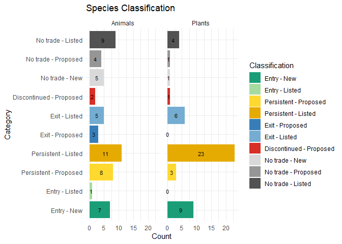
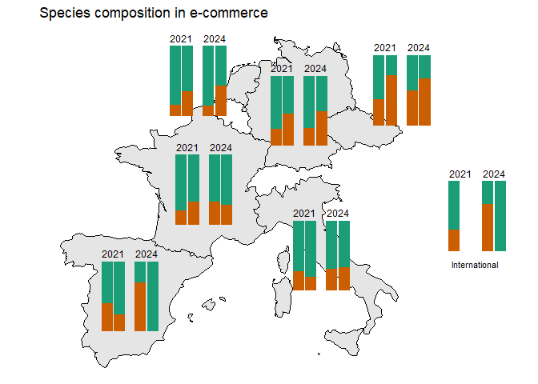
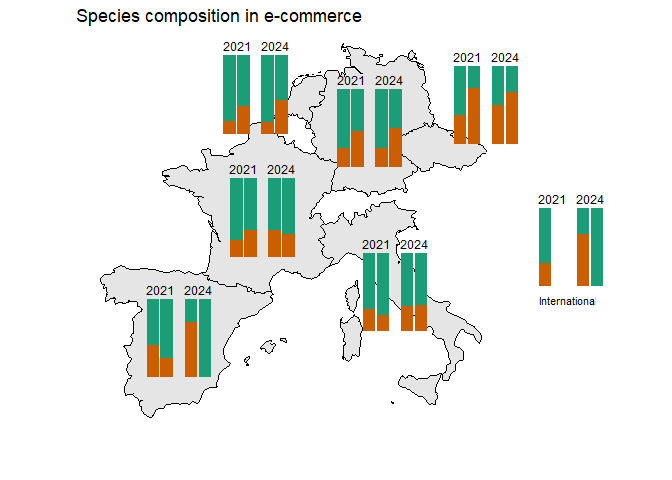
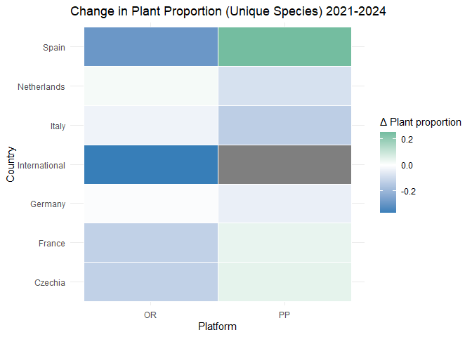

Trade data analysis
================
Theresa Henke
10/06/2026

- [IAS presence in e-commerce
  establishments](#ias-presence-in-e-commerce-establishments)
  - [OneSTOP deliverable 6.1 - corresponding to sub-workflow 2 step
    4](#onestop-deliverable-61---corresponding-to-sub-workflow-2-step-4)
  - [Packages](#packages)
  - [Define functions](#define-functions)
  - [Loading data](#loading-data)
    - [Combine data](#combine-data)
  - [Classify species into Entry, Persistent, and
    Exit](#classify-species-into-entry-persistent-and-exit)
    - [Visualization of species
      classification](#visualization-of-species-classification)
  - [Visalization of the temporal
    development](#visalization-of-the-temporal-development)
    - [Creating the underlying map](#creating-the-underlying-map)
    - [Creating functions](#creating-functions)
    - [Mapping the results](#mapping-the-results)
    - [Creating a heat map of change](#creating-a-heat-map-of-change)

# IAS presence in e-commerce establishments

### OneSTOP deliverable 6.1 - corresponding to sub-workflow 2 step 4

### Packages

``` r
library(ggplot2)
```

    ## Warning: package 'ggplot2' was built under R version 4.4.3

``` r
library(dplyr)
```

    ## Warning: package 'dplyr' was built under R version 4.4.3

    ## 
    ## Attaching package: 'dplyr'

    ## The following objects are masked from 'package:stats':
    ## 
    ##     filter, lag

    ## The following objects are masked from 'package:base':
    ## 
    ##     intersect, setdiff, setequal, union

``` r
library(stringr)
library(tidyr)
library(sf)
```

    ## Warning: package 'sf' was built under R version 4.4.3

    ## Linking to GEOS 3.13.0, GDAL 3.10.1, PROJ 9.5.1; sf_use_s2() is TRUE

``` r
library(rnaturalearth)
```

    ## Warning: package 'rnaturalearth' was built under R version 4.4.3

``` r
library(rnaturalearthdata)
```

    ## Warning: package 'rnaturalearthdata' was built under R version 4.4.3

    ## 
    ## Attaching package: 'rnaturalearthdata'

    ## The following object is masked from 'package:rnaturalearth':
    ## 
    ##     countries110

``` r
library(cowplot)
```

    ## Warning: package 'cowplot' was built under R version 4.4.3

``` r
library(patchwork)
```

    ## Warning: package 'patchwork' was built under R version 4.4.3

    ## 
    ## Attaching package: 'patchwork'

    ## The following object is masked from 'package:cowplot':
    ## 
    ##     align_plots

## Define functions

``` r
clean_species <- function(x){
  x %>% 
    # Remove question marks and asterisks
    str_remove("[?]+") %>% 
    str_remove("[*]+") %>% 
    
    # Remove all brackets with synonym names
    str_remove("[(][^()]+[)]") %>%
    
    # Remove excessive spaces
    str_squish() 
}
```

## Loading data

``` r
species.2021 <- read.csv("species_list_2021.csv")
species.2024 <- read.csv("species_list_2024.csv")

# Trading records
unique.records.2021 <- read.csv("unique_records_2021.csv") %>% 
  rename_with(tolower) %>% 
  select(species, platform, kingdom, country) %>% 
  mutate(year = "2021")

unique.records.2024 <- read.csv("unique_records_2024.csv") %>% 
  rename_with(tolower) %>% 
  select(species, platform, kingdom, country) %>% 
  mutate(year = "2024")

unique.records.all <- bind_rows(unique.records.2024, unique.records.2021) %>% 
  mutate(across(kingdom,~factor(.x, levels = c("Plant", "Animal"))))

# surveyed species in 2021
surveyed.in.2021 <- unique.records.2021 %>% 
  pull("species") %>% 
  clean_species() %>% 
  unique()

# traded species in 2021
traded.in.2021 <- read.csv("results_2021.csv") %>% 
  pull("Species") %>%
  clean_species() %>% 
  unique()

# surveyed species in 2024
surveyed.in.2024 <- unique.records.2024 %>% 
  pull("species") %>% 
  clean_species() %>% 
  unique()

# traded species in 2024
traded.in.2024 <- read.csv("results_2024.csv") %>% 
  filter(Total.number.establishments.found.in > 0) %>% 
  pull("Species") %>% 
  clean_species() %>% 
  unique()
```

### Combine data

``` r
#select and rename columns of 2021 and 2024 data
species.2021.sel <- species.2021 %>%
  rename_with(tolower) %>% 
  select(
    species = scientific.name,
    kingdom,
    status.2021 = union.concern.status,
    sector.2021 = sector
  ) %>% 
  mutate(species_clean = clean_species(species))

species.2024.sel <- species.2024 %>%
  rename_with(tolower) %>% 
  select(
    species,
    kingdom,
    status.2024 = status,
    sector.2024 = sector,
  ) %>% 
  mutate(species_clean = clean_species(species))

#to check alignment of species list
## This works only in case the list is ordered!
# identical(species.2021.sel$species, species.2024.sel$species) #returns NO
setdiff(species.2021.sel$species, species.2024.sel$species) #highlights 3 species that were proposed in 2021 but not included in 2024
```

    ## [1] "Ameiurus nebulosus"   "Pterois miles"        "Phytolacca americana"

``` r
setdiff(species.2024.sel$species, species.2021.sel$species) #highlights the 22 species that were added as "proposed" to the 2024 list
```

    ##  [1] "Acacia mearnsii"                                       
    ##  [2] "Acridotheres cristatellus"                             
    ##  [3] "Brachyponera chinensis"                                
    ##  [4] "Broussonetia papyrifera"                               
    ##  [5] "Cherax destructor"                                     
    ##  [6] "Cherax quadricarinatus"                                
    ##  [7] "Cipangopaludina chinensis (syn. Bellamya chinensis)"   
    ##  [8] "Cortaderia selloana"                                   
    ##  [9] "Crassula helmsii"                                      
    ## [10] "Delairea odorata (syn. Senecio mikanioides)"           
    ## [11] "Faxonius immunis"                                      
    ## [12] "Marisa cornuarietis"                                   
    ## [13] "Misgurnus anguillicaudatus"                            
    ## [14] "Misgurnus bipartitus"                                  
    ## [15] "Myiopsitta monachus"                                   
    ## [16] "Neogale vison"                                         
    ## [17] "Pycnonotus jocosus"                                    
    ## [18] "Reynoutria japonica (syn. Fallopia japonica)"          
    ## [19] "Reynoutria sachalinensis (syn. Fallopia sachalinensis)"
    ## [20] "Reynoutria x bohemica (syn. Fallopia x bohemica)"      
    ## [21] "Tradescantia fluminensis"                              
    ## [22] "Zostera japonica"

``` r
#combine in one df
species.combined <- species.2024.sel %>%
  full_join(species.2021.sel) %>%
  mutate(
    found.in.trade.2021 = if_else(species_clean %in% traded.in.2021, "Yes","No"),
    found.in.trade.2024 = if_else(species_clean %in% traded.in.2024, "Yes", "No"),
    status.2024 = case_when(
      str_detect(status.2024, "^Union concern") ~ "Union concern",
      status.2024 == "Proposed" ~ "Proposed"
    ),
  )
```

    ## Joining with `by = join_by(species, kingdom, species_clean)`

## Classify species into Entry, Persistent, and Exit

The classification takes into account the species’ status in 2021 and
2024 as well as whether it was considered for analysis in 2021.

This results in the following 11 classifications (10 present in
presented data) based on the decision tree: Included in 2021? (Yes/No) -
Status 2021? (NA/Proposed/Union concern) - Found in trade in 2021?
(NA/No/Yes) - Status 2024? (Proposed/Union concern) - Found in trade in
2024? (No/Yes) (**Please note:** 4 species are classified as “Union
concern delayed to 2024/2027” but were considered as listed on the Union
concern list for the analysis; all were persistent-proposed)

**Entry - New:** Species was not included in 2021 survey but was listed
included as a proposed IAS in 2024 and found in trade

**Entry - Proposed:** Species was included as a proposed IAS in 2021
survey. It was not identified in any e-commerce establishments in 2021
but was documented in 2024 as a listed IAS present in at least one
e-commerce establishment.

**Entry - Listed:** Species was already included as a listed IAS in
2021. While it was not documented in any e-commerce establishment that
year, it was documented in at least one establishment in 2024.

**Persistent - Proposed:** Species was identified on at least one
establishment in both years. While it was included as a proposed IAS in
2021 it was categorized as a listed IAS in 2024.

**Persistent - Listed:** Species was identified as listed IAS in at
least one establishment in 2021 and 2024.

**Exit - Proposed:** Species was identified as a proposed IAS in at
least one establishment in 2021 but categorized as a listed IAS in the
2024 survey it was not documented in any establishment.

**Exit - Listed:** Species was categorized as listed IAS in both surveys
but was identified in at least one establishment only in 2021.

**Discontinued - Proposed:** Species was categorized as proposed IAS and
found in trade in 2021 but was not included in the 2024 survey.

**No trade - New:** Species was only included as proposed IAS in 2024
but was not found in trade.

**No trade - Proposed:** Species was categorized as proposed IAS in 2021
and listed IAS in 2024 but was not found in trade in either year.

**No trade - Listed:** Species was categorized as listed IAS in 2021 and
2024 but was not found in trade in either year.

``` r
species.classified <- species.combined %>%
  mutate(
    category = case_when(

      # Species traded in both years
      found.in.trade.2021 == "Yes" &
      found.in.trade.2024 == "Yes" ~ if_else(
        status.2021 == "Proposed",
        "Persistent - Proposed",
        "Persistent - Listed"
      ),

      # Species traded only in 2024
      found.in.trade.2021 == "No" &
      found.in.trade.2024 == "Yes" ~ case_when(

        # Species not surveyed in 2021
        is.na(status.2021) ~ "Entry - New",

        # Species surveyed as union concern in 2021
        status.2021 == "Union concern" ~ "Entry - Listed"
      ),

      # Species traded only in 2021
      found.in.trade.2021 == "Yes" &
      found.in.trade.2024 == "No" ~ case_when(

        # Proposed in 2021 and absent in 2024
        status.2021 == "Proposed" &
        is.na(status.2024) ~ "Discontinued - Proposed",

        # Proposed in 2021 and still present in 2024
        status.2021 == "Proposed" ~ "Exit - Proposed",

        # Union concern in 2021
        status.2021 == "Union concern" ~ "Exit - Listed"
      ),

      # No trade in either year
      found.in.trade.2021 == "No" &
      found.in.trade.2024 == "No" ~ case_when(

        is.na(status.2021) &
        status.2024 == "Proposed" ~ "No trade - New",

        status.2021 == "Proposed" &
        status.2024 == "Union concern" ~ "No trade - Proposed",

        status.2021 == "Union concern" &
        status.2024 == "Union concern" ~ "No trade - Listed"
      ),

      TRUE ~ NA_character_
    )
  ) %>%
  mutate(
    category = factor(
      category,
      levels = c(
        "Entry - New",
        "Entry - Listed",
        "Persistent - Proposed",
        "Persistent - Listed",
        "Exit - Proposed",
        "Exit - Listed",
        "Discontinued - Proposed",
        "No trade - New",
        "No trade - Proposed",
        "No trade - Listed"
      )
    )
  )
```

### Visualization of species classification

``` r
# Create counts and include all categories in graph
plot_data <- species.classified %>%
  count(category, kingdom) %>%
  complete(category, kingdom, fill = list(n = 0))

# Define colors for updated categories
base_colors <- c(
  "Entry - New" = "#1b9e77",
  "Entry - Listed" = "#a6dba0",

  "Persistent - Proposed" = "#ffd92f",
  "Persistent - Listed" = "#e6ab02",

  "Exit - Proposed" = "#377eb8",
  "Exit - Listed" = "#74add1",

  "Discontinued - Proposed" = "#d73027",

  "No trade - New" = "#d9d9d9",
  "No trade - Proposed" = "#969696",
  "No trade - Listed" = "#525252"
)

# Graph the data and display counts
ggplot(plot_data,
       aes(x = category,
           y = n,
           fill = category)) +

  geom_col(position = "stack") +

  geom_text(
    aes(label = n),
    position = position_stack(vjust = 0.5),
    size = 3
  ) +

  coord_flip() +

  scale_fill_manual(
    values = base_colors,
    drop = FALSE,
    name = "Classification"
  ) +

  theme_minimal() +

  labs(
    title = "Species Classification",
    x = "Category",
    y = "Count"
  ) +

  facet_wrap(~ kingdom)
```

<!-- -->

## Visalization of the temporal development

``` r
#defining colors for displaying Plants vs Animals
colors <- c(
  "Plant" = "#1b9e77",
  # "Animal" = "#377eb8"
  "Animal" = "#cb5e00ff"
)

#adjusting the data to explore the development of species presence (yes/no) in trade
distinct_species <- unique.records.all %>%
  filter(!str_detect(species, "sp[p]*[.]$")) %>% 
  distinct_all()

distinct_species_counts <- distinct_species %>% 
  count(country, year, platform, kingdom)

all_species_counts <- unique.records.all %>% 
  filter(!str_detect(species, "sp[p]*[.]$")) %>% 
  count(country, year, platform, kingdom) %>%
  mutate(across(kingdom,~factor(.x, levels = c("Plant", "Animal"))))
```

### Creating the underlying map

``` r
# Set the countries of interest
countries <- c("Germany", "Spain", "Czechia", "France", "Italy", "Netherlands")

# Get the map of Europe as sf object
map_data <- ne_countries(scale = "medium", continent = "Europe", returnclass = "sf") %>% 
  select(geometry, name) %>%
  filter(name %in% countries) %>% 
  st_crop(xmin = -10, xmax = 35, ymin = 34, ymax = 72)
```

    ## Warning: attribute variables are assumed to be spatially constant throughout
    ## all geometries

``` r
centroids <- st_centroid(map_data) %>% 
  st_coordinates() %>% 
  as.data.frame() %>% 
  bind_cols(country = map_data$name) %>% 
  add_row(X = 25,   # longitude (adjust visually)
    Y = 45,   # latitude (adjust visually)
    country = "International"
  )
```

    ## Warning: st_centroid assumes attributes are constant over geometries

### Creating functions

1)  a function to create individual stacked bar plots per country. The
    plots indicate the composition of animal and plant species found in
    Online retailers (left bar) and Peer-to-peer trade platforms (right)
    in 2021 and 2024

2)  a function to display the individual bar plots on the underlying ma

``` r
make_barplot <- function(df, show_legend = FALSE) {
   df %>% 
    complete(platform, year, kingdom, fill = list(n = 0)) %>%
    ggplot(aes(x = platform, y = n, fill = kingdom)) +
      geom_col(position = "fill") +
      facet_wrap(~year) +
      scale_fill_manual(values = colors, drop = FALSE) +
       labs(
        x = "Platform",
        fill = "Kingdom"
      ) +
      theme_void()+
      theme(
        legend.position = if_else(show_legend, "bottom", "none")
      )
}


make_map_plot <- function(map_df, summary_df, centroids_df, title_text) {
  base_map <- ggplot() +
    geom_sf(data = map_df, fill = "grey90", color = "black") +
    theme_void() +
    labs(title = title_text)
  
  # Define size of grobs
  x_width = 5
  y_width = 5

  for (i in 1:nrow(centroids_df)) {
    country_name <- centroids_df$country[i]

    p <- make_barplot(filter(summary_df, country == country_name))

    # Netherlands: move left
    if (country_name == "Netherlands") {
      x_offset <- -6
      y_offset <- -2
    }
    
    # Czechia: move right and up
    else if (country_name == "Czechia") {
      x_offset = 1
      y_offset = 0
    }
    
    # Otherwise we have to put the values back to default.
    else{
      x_offset <- -x_width/2
      y_offset <- -y_width/2
    }
    
    base_map <- base_map +
      annotation_custom(
        grob = ggplotGrob(p),
        xmin = centroids_df$X[i] + x_offset,
        xmax = centroids_df$X[i] + x_offset + x_width,
        ymin = centroids_df$Y[i] + y_offset,
        ymax = centroids_df$Y[i] + y_offset + y_width
      )
  }
  
  base_map <- base_map +
    annotate(
      "text",
      x = 25,
      y = 42,
      label = "International  ",   #would not print the whole of International otherwise
      size = 3
    )
  
  return(base_map)
}
```

### Mapping the results

``` r
map_species <- make_map_plot(map_df = map_data, summary_df = distinct_species_counts,
                             centroids_df = centroids, 
  "Species composition in e-commerce"
)

map_species
```

<!-- -->

``` r
#creating a legend
legend_source <- make_barplot(filter(distinct_species_counts, country == "Germany"), show_legend = TRUE)

legend_only <- get_legend(legend_source)
```

    ## Warning in get_plot_component(plot, "guide-box"): Multiple components found;
    ## returning the first one. To return all, use `return_all = TRUE`.

``` r
#adding the legend to the figure
map_bar_species <- plot_grid(
  map_species,
  legend_only,
  ncol = 1,
  rel_heights = c(1, 0.1)
)

map_bar_species
```

<!-- -->

### Creating a heat map of change

The heat map will display the changes in plant and animal species
composition per platform type and country. Specifically, the heat map
shows the changes in plant proportions with positive values indicating
more plants and negative values indicating more animals.

``` r
make_heatmap <- function(summary_data, title_text) {

  heat_data <- summary_data %>%
    group_by(country, year, platform) %>%    # Changed to lowercase
    mutate(prop = n / sum(n)) %>%
    ungroup() %>%
    filter(kingdom == "Plant") %>%           # Changed to lowercase
    select(country, platform, year, prop) %>% # Changed to lowercase
    tidyr::pivot_wider(
      names_from = year,
      values_from = prop
    ) %>%
    mutate(change = `2024` - `2021`)

  ggplot(heat_data, aes(x = platform, y = country, fill = change)) + # Changed to lowercase
    geom_tile(color = "white") +
    scale_fill_gradient2(
      low = "#377eb8",   # more animals
      mid = "white",
      high = "#1b9e77",  # more plants
      midpoint = 0
    ) +
    labs(
      title = title_text,
      x = "Platform",
      y = "Country",
      fill = "Δ Plant proportion"
    ) +
    theme_minimal() +
    theme(legend.position = "right")
}

heat_species <- make_heatmap(
  distinct_species_counts,
  "Change in Plant Proportion (Unique Species) 2021-2024"
)

heat_species
```

<!-- -->
