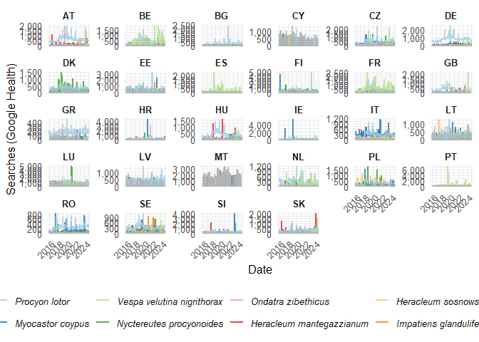
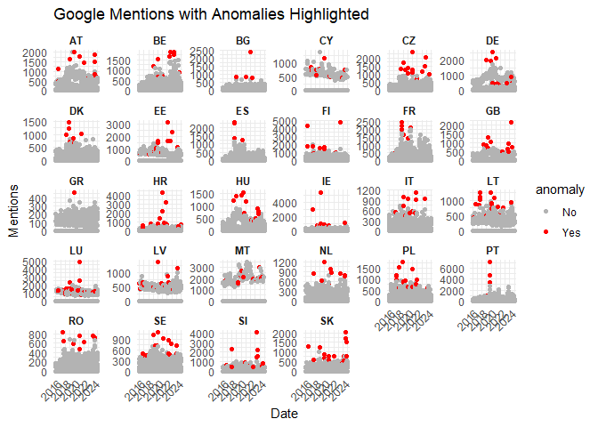
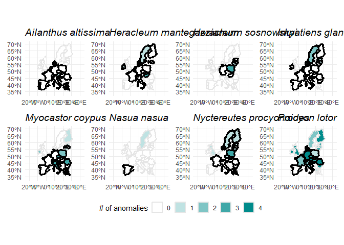
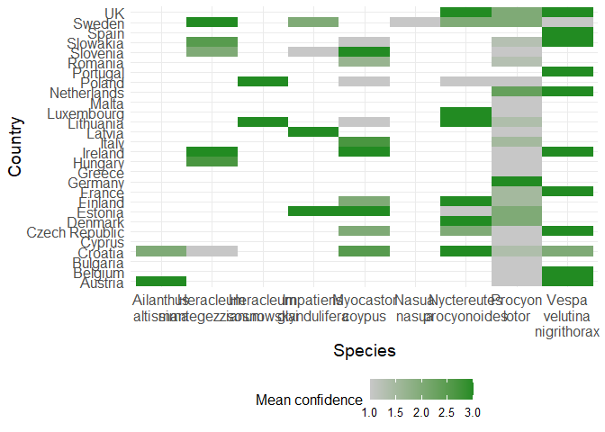
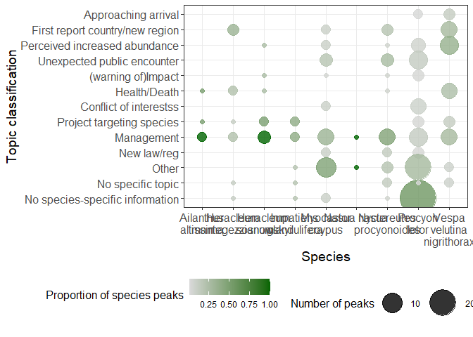

Peak analysis
================
Theresa Henke
10/06/2026

- [Public interest in invasive alien
  species](#public-interest-in-invasive-alien-species)
  - [OneSTOP deliverable 6.1 - corresponding to sub-workflow 1 steps
    4-6](#onestop-deliverable-61---corresponding-to-sub-workflow-1-steps-4-6)
  - [Packages](#packages)
  - [Loading data](#loading-data)
    - [First the plant data](#first-the-plant-data)
    - [Updating dataset with missing data for two
      species](#updating-dataset-with-missing-data-for-two-species)
  - [Step 4: Identifying the 10 species with the highest cumulated
    public
    interest](#step-4-identifying-the-10-species-with-the-highest-cumulated-public-interest)
  - [Step 5: Identify the peaks and
    anomalies](#step-5-identify-the-peaks-and-anomalies)
  - [Visualizing the species x country
    trajectories](#visualizing-the-species-x-country-trajectories)
  - [Combined identification of peaks and
    anomalies](#combined-identification-of-peaks-and-anomalies)
    - [Manually remove the lower
      peaks](#manually-remove-the-lower-peaks)
    - [Visualize the identified
      anomalies](#visualize-the-identified-anomalies)
  - [Step 6: Identification of peaks in each species x country
    trajectory](#step-6-identification-of-peaks-in-each-species-x-country-trajectory)
    - [Identification of the top 10 peaks per
      country](#identification-of-the-top-10-peaks-per-country)
  - [Step 7: Mapping the distribution of identified anomalies per
    species](#step-7-mapping-the-distribution-of-identified-anomalies-per-species)
    - [Preparations](#preparations)
    - [Create a map per species](#create-a-map-per-species)
  - [Step 8: Visualizing overviews of
    results](#step-8-visualizing-overviews-of-results)
    - [Preparations](#preparations-1)
    - [Visualize the average confidence score for each country x species
      combination](#visualize-the-average-confidence-score-for-each-country-x-species-combination)
    - [Visualize the topic distribution across
      species](#visualize-the-topic-distribution-across-species)

# Public interest in invasive alien species

### OneSTOP deliverable 6.1 - corresponding to sub-workflow 1 steps 4-6

## Packages

``` r
# Default tidyverse packages
library(readr)
```

    ## Warning: package 'readr' was built under R version 4.4.3

``` r
library(dplyr)
```

    ## Warning: package 'dplyr' was built under R version 4.4.3

    ## 
    ## Attaching package: 'dplyr'

    ## The following objects are masked from 'package:stats':
    ## 
    ##     filter, lag

    ## The following objects are masked from 'package:base':
    ## 
    ##     intersect, setdiff, setequal, union

``` r
library(ggplot2)
```

    ## Warning: package 'ggplot2' was built under R version 4.4.3

``` r
library(lubridate)
```

    ## 
    ## Attaching package: 'lubridate'

    ## The following objects are masked from 'package:base':
    ## 
    ##     date, intersect, setdiff, union

``` r
library(purrr)
library(tidyr)
library(stringr)

# Packages for maps
library(rnaturalearth)
```

    ## Warning: package 'rnaturalearth' was built under R version 4.4.3

``` r
library(rnaturalearthdata)
```

    ## Warning: package 'rnaturalearthdata' was built under R version 4.4.3

    ## 
    ## Attaching package: 'rnaturalearthdata'

    ## The following object is masked from 'package:rnaturalearth':
    ## 
    ##     countries110

``` r
library(sf)
```

    ## Warning: package 'sf' was built under R version 4.4.3

    ## Linking to GEOS 3.13.0, GDAL 3.10.1, PROJ 9.5.1; sf_use_s2() is TRUE

``` r
# Plotting packages
library(ggpattern)
```

    ## Warning: package 'ggpattern' was built under R version 4.4.3

``` r
library(cowplot)
```

    ## Warning: package 'cowplot' was built under R version 4.4.3

    ## 
    ## Attaching package: 'cowplot'

    ## The following object is masked from 'package:lubridate':
    ## 
    ##     stamp

``` r
library(patchwork)
```

    ## Warning: package 'patchwork' was built under R version 4.4.3

    ## 
    ## Attaching package: 'patchwork'

    ## The following object is masked from 'package:cowplot':
    ## 
    ##     align_plots

``` r
# Packages for Peak analysis
library(timetk)
```

    ## Warning: package 'timetk' was built under R version 4.4.3

``` r
library(anomalize)
```

    ## Warning: package 'anomalize' was built under R version 4.4.3

    ## 
    ## Attaching package: 'anomalize'

    ## The following objects are masked from 'package:timetk':
    ## 
    ##     anomalize, plot_anomalies

``` r
library(pracma)
```

    ## Warning: package 'pracma' was built under R version 4.4.3

    ## 
    ## Attaching package: 'pracma'

    ## The following object is masked from 'package:purrr':
    ## 
    ##     cross

## Loading data

### First the plant data

``` r
data <- read.csv("data/data_google_uc.csv", fileEncoding="UTF-8", check.names=FALSE) %>%   select(-species_highlight) %>% 
  mutate_at(vars(date), ymd)
```

### Updating dataset with missing data for two species

``` r
# Read all csv files in the directory data/species
data_to_add <- list.files("data/species_google_data", pattern = "csv", full.names = T) %>% 
  map_dfr(function(csv_path){
    read_csv(csv_path) %>% 
    pivot_longer(
      cols = -date,           # Keep date, pivot country columns
      names_to = "country",
      values_to = "mentions"
    ) %>% 
    mutate(csv_path = csv_path)
  }) %>% 
  mutate(species = str_extract(csv_path, "[^/]+$")) %>%
  mutate_at(vars(species), str_remove, "[.]csv$") %>% 
  mutate_at(vars(species), str_replace_all, "_", " ") %>%
  mutate_at(vars(species), str_to_sentence) %>% 
  mutate_at(vars(date), ymd) %>% 
  select(-csv_path)
```

    ## Rows: 471 Columns: 29
    ## ── Column specification ────────────────────────────────────────────────────────
    ## Delimiter: ","
    ## dbl  (28): AT, BE, BG, CY, CZ, DE, DK, EE, ES, FI, FR, GB, GR, HR, HU, IE, I...
    ## date  (1): date
    ## 
    ## ℹ Use `spec()` to retrieve the full column specification for this data.
    ## ℹ Specify the column types or set `show_col_types = FALSE` to quiet this message.
    ## Rows: 471 Columns: 29
    ## ── Column specification ────────────────────────────────────────────────────────
    ## Delimiter: ","
    ## dbl  (28): AT, BE, BG, CY, CZ, DE, DK, EE, ES, FI, FR, GB, GR, HR, HU, IE, I...
    ## date  (1): date
    ## 
    ## ℹ Use `spec()` to retrieve the full column specification for this data.
    ## ℹ Specify the column types or set `show_col_types = FALSE` to quiet this message.

``` r
# Combine all data into one
data <- bind_rows(data, data_to_add)

data %>% 
  group_by(species, country) %>% 
  slice_min(date) %>% 
  write.csv("first_record_species_per_country.csv", row.names = FALSE)
```

## Step 4: Identifying the 10 species with the highest cumulated public interest

``` r
weekly_species_summary <- data %>%
  group_by(date, species) %>%
  summarise(total_value = sum(mentions, na.rm = TRUE)) %>%
  ungroup()
```

    ## `summarise()` has grouped output by 'date'. You can override using the
    ## `.groups` argument.

``` r
top_species <- weekly_species_summary %>%
  group_by(species) %>%
  summarise(total_mentions = sum(total_value, na.rm = TRUE)) %>%
  slice_max(order_by = total_mentions, n = 10) %>%
  pull(species)

print(top_species)
```

    ##  [1] "Procyon lotor"              "Myocastor coypus"          
    ##  [3] "Vespa velutina nigrithorax" "Nyctereutes procyonoides"  
    ##  [5] "Ondatra zibethicus"         "Heracleum mantegazzianum"  
    ##  [7] "Heracleum sosnowskyi"       "Impatiens glandulifera"    
    ##  [9] "Ailanthus altissima"        "Nasua nasua"

``` r
#indicate the species names where it is top 10
data <- data %>%
  mutate(species_grouped = if_else(species %in% top_species, as.character(species), "other"))
```

## Step 5: Identify the peaks and anomalies

## Visualizing the species x country trajectories

We are displaying the trajectories for all species but are highlighting
the trajectories for the top 10 species by highlighting them in
different colors.

``` r
colors = c(setNames(RColorBrewer::brewer.pal(length(top_species), "Paired"), top_species), other = "gray70")

ggplot(data, aes(x = date, y = mentions, group = species, color = species_grouped)) + #colour only the most mentioned species 
  geom_line(linewidth = 1, alpha = 0.8) + 
  facet_wrap(~country, scales = "free_y") + 
  scale_color_manual(
    values = colors,
    breaks = top_species,
    name = "Top Species"
  ) + 
  scale_y_continuous(labels = scales::comma_format()) +
  theme_minimal(base_size = 12) + 
  labs(
    
    x = "Date",
    y = "Searches (Google Health)"
  ) + 
  theme(
    legend.position = "bottom",
    legend.text = element_text(face = "italic"),
    strip.text = element_text(face = "bold"),
    axis.text.x = element_text(angle = 45, hjust = 1)
  ) 
```

<!-- -->

## Combined identification of peaks and anomalies

Here we identify:

**Peak** - A local maximum in a time series (raw data)

**Anomaly** - A local maximum in a time series after excluding the
underlying seasonal and long-term trends from the data.

``` r
# Make sure to initialize the list fresh every time you run this
all_results <- list()
all_anomalies <- list()

# Get unique issue-country combos, filter straight away only for combos containing at least three rows

combos <- data %>% 
  count(species, country) %>% 
  filter(n > 2)

for (i in seq_len(nrow(combos))) {
  sci_name <- combos$species[i]
  country_name  <- combos$country[i]
  
  sub_df <- data %>%
    filter(species == sci_name,
           country == country_name) %>%
    arrange(date)
  
#  if (nrow(sub_df) < 3) next
  
  results <- sub_df %>%
    group_by(species, country) %>%
    time_decompose(mentions, method = "twitter", frequency = "auto", trend = "auto")%>%
    anomalize(remainder, method = "gesd", alpha = 0.99, max_anoms = 0.01) %>%
    time_recompose() %>%
    select(species, country, date, anomaly) %>%
    ungroup()
  
  all_results[[i]] <- results
  
  ##! No need to do this per partes - we will do it one ago from the results
  #Add this block to collect anomalies
  # flagged <- results %>%
  #   filter(anomaly == "Yes") %>%
  #   select(species, country, date)
  # 
  # if (nrow(flagged) > 0) {
  #   all_anomalies[[length(all_anomalies) + 1]] <- flagged
  # }
}
```

    ## Registered S3 method overwritten by 'quantmod':
    ##   method            from
    ##   as.zoo.data.frame zoo

``` r
# Combine all results, keep all rows (no distinct to preserve all anomalies)


df_anomalies <- bind_rows(all_results) %>% 
  filter(anomaly == "Yes") %>%
  distinct(species, country, date, anomaly)


# Add anomaly column to original df (safe join: 1:1 mapping)
data_with_anomaly <- data %>%
  left_join(df_anomalies, by = c("species", "country", "date")) %>%
  mutate(anomaly = replace_na(anomaly, "No"))

write.csv(data_with_anomaly, "data_with_anomaly.csv", row.names = FALSE)
```

### Manually remove the lower peaks

We arbitrarily selected the minimum of 400 mentions.

``` r
data_with_anomaly_high <- data_with_anomaly %>%
  mutate(anomaly = if_else(
    species_grouped != "other" & anomaly == "Yes" & mentions >= 400, "Yes", "No"
  ))
```

### Visualize the identified anomalies

``` r
ggplot(data_with_anomaly_high, aes(x = date, y = mentions, group = species, color = anomaly)) +
  #geom_line(alpha = 0.6) +
  geom_point(size = 1.5) +
  facet_wrap(~ country, scales = "free_y") +
  scale_color_manual(values = c("No" = "gray70", "Yes" = "red")) +
  labs(title = "Google Mentions with Anomalies Highlighted", y = "Mentions", x = "Date") +
  theme_minimal() +
  theme(
    axis.text.x = element_text(angle = 45, hjust = 1),
    strip.text = element_text(face = "bold")
  )
```

<!-- -->

## Step 6: Identification of peaks in each species x country trajectory

### Identification of the top 10 peaks per country

``` r
peaks_df <- data %>%
  group_by(species, country) %>%
  group_split() %>%
  map_dfr(function(data_subset) {
    data_subset <- arrange(data_subset, date)
    peaks <- findpeaks(data_subset$mentions)
    
    if(!is.null(peaks)) {
      peak_indices <- peaks[, 2]
      peak_values <- peaks[, 1]
      
      tibble(
        species = data_subset$species[1],
        country = data_subset$country[1],
        date = data_subset$date[peak_indices],
        peak_height = peak_values
      )
    }
  })

# For each country, keep only the 10 highest peaks
top10_peaks_per_country <- peaks_df %>%
  group_by(country) %>%
  slice_max(order_by = peak_height, n = 10, with_ties = TRUE) %>%
  arrange(country, desc(peak_height)) %>%
  ungroup()

#extract result as csv file
write.csv(top10_peaks_per_country, "updated_top_10_peaks_per_country.csv", row.names = FALSE)
```

## Step 7: Mapping the distribution of identified anomalies per species

### Preparations

``` r
# Load country polygons (scale = "medium" gives good detail)
world <- ne_countries(scale = "medium", returnclass = "sf")

# Filter to keep only European countries (excluding russia to keep map concise)
europe <- world %>%
  filter(region_un == "Europe", iso_a3 != "RUS")

# Roughly: west = -25, east = 45, south = 34, north = 72
europe_bbox <- st_bbox(c(xmin = -25, xmax = 45, ymin = 32, ymax = 72), crs = st_crs(europe))

europe_mainland <- st_crop(europe, europe_bbox)
```

    ## Warning: attribute variables are assumed to be spatially constant throughout
    ## all geometries

``` r
eu_countries <- c(
  "Austria", "Belgium", "Bulgaria", "Croatia", "Cyprus", "Czechia", "Denmark",
  "Estonia", "Finland", "France", "Germany", "Greece", "Hungary", "Ireland",
  "Italy", "Latvia", "Lithuania", "Luxembourg", "Malta", "Netherlands",
  "Poland", "Portugal", "Romania", "Slovakia", "Slovenia", "Spain", "Sweden", "United Kingdom"
)

europe_mainland <- europe_mainland %>%
  mutate(is_eu = ifelse(name %in% eu_countries, TRUE, FALSE))
```

### Create a map per species

``` r
# establish color scheme
anomaly_colors <- c(
  "0" = "#ffffff",
  "1" = "#bfe2e2",
  "2" = "#7fc5c5",
  "3" = "#3fa8a8",
  "4" = "#008b8b"   # darkcyan
)

## Species descriptions
species_descriptions <- list.files("data/species_descriptions_clean/", full.names = TRUE) %>%
  map_dfr(read_csv)
```

    ## Rows: 28 Columns: 5
    ## ── Column specification ────────────────────────────────────────────────────────
    ## Delimiter: ","
    ## chr (4): species, country, name, established
    ## dbl (1): first_record
    ## 
    ## ℹ Use `spec()` to retrieve the full column specification for this data.
    ## ℹ Specify the column types or set `show_col_types = FALSE` to quiet this message.
    ## Rows: 28 Columns: 5
    ## ── Column specification ────────────────────────────────────────────────────────
    ## Delimiter: ","
    ## chr (4): species, country, name, established
    ## dbl (1): first_record
    ## 
    ## ℹ Use `spec()` to retrieve the full column specification for this data.
    ## ℹ Specify the column types or set `show_col_types = FALSE` to quiet this message.
    ## Rows: 28 Columns: 5
    ## ── Column specification ────────────────────────────────────────────────────────
    ## Delimiter: ","
    ## chr (4): species, country, name, established
    ## dbl (1): first_record
    ## 
    ## ℹ Use `spec()` to retrieve the full column specification for this data.
    ## ℹ Specify the column types or set `show_col_types = FALSE` to quiet this message.
    ## Rows: 28 Columns: 5
    ## ── Column specification ────────────────────────────────────────────────────────
    ## Delimiter: ","
    ## chr (4): species, country, name, established
    ## dbl (1): first_record
    ## 
    ## ℹ Use `spec()` to retrieve the full column specification for this data.
    ## ℹ Specify the column types or set `show_col_types = FALSE` to quiet this message.
    ## Rows: 28 Columns: 5
    ## ── Column specification ────────────────────────────────────────────────────────
    ## Delimiter: ","
    ## chr (4): species, country, name, established
    ## dbl (1): first_record
    ## 
    ## ℹ Use `spec()` to retrieve the full column specification for this data.
    ## ℹ Specify the column types or set `show_col_types = FALSE` to quiet this message.
    ## Rows: 28 Columns: 5
    ## ── Column specification ────────────────────────────────────────────────────────
    ## Delimiter: ","
    ## chr (4): species, country, name, established
    ## dbl (1): first_record
    ## 
    ## ℹ Use `spec()` to retrieve the full column specification for this data.
    ## ℹ Specify the column types or set `show_col_types = FALSE` to quiet this message.
    ## Rows: 28 Columns: 5
    ## ── Column specification ────────────────────────────────────────────────────────
    ## Delimiter: ","
    ## chr (4): species, country, name, established
    ## dbl (1): first_record
    ## 
    ## ℹ Use `spec()` to retrieve the full column specification for this data.
    ## ℹ Specify the column types or set `show_col_types = FALSE` to quiet this message.
    ## Rows: 28 Columns: 5
    ## ── Column specification ────────────────────────────────────────────────────────
    ## Delimiter: ","
    ## chr (4): species, country, name, established
    ## dbl (1): first_record
    ## 
    ## ℹ Use `spec()` to retrieve the full column specification for this data.
    ## ℹ Specify the column types or set `show_col_types = FALSE` to quiet this message.
    ## Rows: 28 Columns: 5
    ## ── Column specification ────────────────────────────────────────────────────────
    ## Delimiter: ","
    ## chr (4): species, country, name, established
    ## dbl (1): first_record
    ## 
    ## ℹ Use `spec()` to retrieve the full column specification for this data.
    ## ℹ Specify the column types or set `show_col_types = FALSE` to quiet this message.

``` r
peaks_summary <- peaks_df %>%
  group_by(country) %>%
  slice_max(peak_height, n = 10) %>%
  inner_join(data_with_anomaly_high) %>%
  group_by(species, country) %>%
  summarise(
    number_of_anomalies = sum(anomaly == "Yes"),
    number_of_peaks     = n(),
    first_date_of_peaks = min(date),
    last_date_of_peaks  = max(date),
    .groups = "drop") %>%
  complete(species, country, fill = list(number_of_anomalies = 0)) %>%
  mutate(number_of_anomalies = as.factor(number_of_anomalies)) %>%
  inner_join(species_descriptions)
```

    ## Joining with `by = join_by(species, country, date)`
    ## Joining with `by = join_by(species, country)`

``` r
species_description_plots <- peaks_summary %>%
  group_split(species) %>%
  map(function(peaks_summary_subset) {
    species_name <- unique(peaks_summary_subset$species)

    species_data <- europe_mainland %>%
      select(name, geometry) %>%
      inner_join(peaks_summary_subset, by = "name")

    ggplot(species_data) +
      geom_sf(aes(fill = number_of_anomalies),
              color = "grey90", linewidth = 0.8,
              show.legend = TRUE) +                 # <- vynutí všechny úrovně do legendy
      geom_sf(
        data = subset(species_data, established == "Yes"),
        fill = NA, color = "black", linewidth = 1.2,
        show.legend = FALSE                         # outline jen, do legendy nepatří
      ) +
      scale_fill_manual(
        values = anomaly_colors,
        drop   = FALSE,                             # <- drží všechny kategorie
        name   = "# of anomalies"
      ) +
      coord_sf(xlim = c(-25, 45), ylim = c(32, 72), expand = FALSE) +
      theme_minimal() +
      labs(title = species_name) +
      theme(plot.title = element_text(size = 14, face = "italic"))
  })

### Combine plots into one figure
combined <- wrap_plots(species_description_plots, ncol = 4) +
  plot_layout(guides = "collect") & theme(legend.position = "bottom")
combined
```

<!-- -->

## Step 8: Visualizing overviews of results

### Preparations

``` r
#read in data
raw_data <- read.csv("Peak identification.csv")
#condense data to necessary columns
drivers_explore <- raw_data %>%
  select(c(1:4, 7, 9, 10))

#Aligning and preparing the columns
#renaming columns
colnames(drivers_explore)
```

    ## [1] "Country"                                  
    ## [2] "Species"                                  
    ## [3] "Date"                                     
    ## [4] "included.on.the.list.at.the.time.of.peak."
    ## [5] "Confidence"                               
    ## [6] "driver.classification"                    
    ## [7] "X"

``` r
drivers_explore <- drivers_explore %>%
  rename(
   Listed = included.on.the.list.at.the.time.of.peak.,
   Topics = driver.classification,
   Classification = X
  )
#create extra column indicating whether or not general information was shared
drivers_explore <- drivers_explore %>%
  mutate(
    General_info =
      if_else(
        str_detect(
          Topics,
          "General information sharing without specific angle"
        ),
        "Yes",
        "No"
      )
  )
#create an extra column indicating when only general information was shared about the species without specific topic (yes/no)
#also replace NAs with "No specific topic"
drivers_explore <- drivers_explore %>%
  mutate(
    # Create indicator
    General_info = if_else(
      str_detect(
        Topics,
        "General information sharing without specific angle"
      ),
      "Yes",
      "No"
    ),
    
    # Remove the category from Topics
    Topics = str_remove_all(
      Topics,
      "General information sharing without specific angle"
    ),
    
    # Clean separators and spaces
    Topics = str_remove_all(Topics, "^\\s*,\\s*|\\s*,\\s*$"),
    Topics = str_replace_all(Topics, "\\s*,\\s*,", ","),
    Topics = str_squish(Topics),
    
    # Replace empty values
    Topics = if_else(
      Topics == "",
      "No specific topic",
      Topics
    )
  )

## add a PeakID to keep track
drivers_explore <- drivers_explore %>%
  mutate(PeakID = row_number())

#Turn into long format + removing the extra space from separating the levels in Classification
drivers_long <- drivers_explore %>%
  separate_rows(Classification, sep = ",")%>%
  mutate(Classification = str_trim(Classification))

#check levels
unique(drivers_long$Classification)
```

    ##  [1] "Health/Death"                    "Management"                     
    ##  [3] "Project targeting species"       "No species-specific information"
    ##  [5] "First report country/new region" ""                               
    ##  [7] "(warning of)Impact"              "Perceived increased abundance"  
    ##  [9] "Other"                           "Unexpected public encounter"    
    ## [11] "New law/reg"                     "Conflict of interestss"         
    ## [13] "Approaching arrival"

``` r
#align levels
drivers_long <- drivers_long %>%
  mutate(
    Classification = str_trim(Classification)
  )
drivers_long <- drivers_long %>%
  mutate(
    Classification = if_else(
      Classification == "",
      "No specific topic",
      Classification
    )
  )
```

### Visualize the average confidence score for each country x species combination

``` r
##heatmap for country, species, & average confidence

##average confidence per country/species
drivers_explore <- drivers_explore %>%
  mutate(
    Confidence_num = case_when(
      Confidence == "low" ~ 1,
      Confidence == "medium" ~ 2,
      Confidence == "high" ~ 3
    )
  )

heat_data_conf <- drivers_explore %>%
  group_by(Country, Species) %>%
  summarise(
    MeanConfidence = mean(Confidence_num, na.rm = TRUE),
    .groups = "drop"
  )

#to make species names displayed over multiple lines
heat_data_conf <- heat_data_conf %>%
  mutate(
    Species_label = gsub(" ", "\n", Species)
  )

#plot
ggplot(heat_data_conf,
       aes(x = Species_label,
           y = Country,
           fill = MeanConfidence)) +
  geom_tile() +
  theme_minimal() +
  labs(
    x = "Species",
    y = "Country",
    fill = "Mean confidence")+
  scale_fill_gradient(
    low = "grey78",
    high = "forestgreen"
  )+
  theme(
    legend.position = "bottom",
    axis.text.x = element_text(size = 12),
    axis.text.y = element_text(size = 12),
    axis.title = element_text(size = 14),
    plot.title = element_text(size = 16, face = "bold"),
    legend.title = element_text(size = 12),
    legend.text = element_text(size = 10)
  )
```

<!-- -->

### Visualize the topic distribution across species

``` r
#bubble map with proportions
species_totals <- drivers_long %>%
  distinct(PeakID, Species) %>%
  count(Species, name = "TotalPeaks")

driver_species <- drivers_long %>%
  distinct(PeakID, Species, Classification) %>%
  count(Species, Classification, name = "DriverPeaks")

driver_species <- driver_species %>%
  left_join(species_totals,
            by = "Species") %>%
  mutate(
    Proportion = DriverPeaks / TotalPeaks
  )
driver_species <- driver_species %>%
  mutate(
    Species_label = str_wrap(Species, width = 12)
  )

ggplot(driver_species,
       aes(x = Species_label,
           y = Classification,
           size = DriverPeaks,
           colour = Proportion)) +
  geom_point(alpha = 0.8) +
  scale_colour_gradient(
    low = "grey85",
    high = "darkgreen"
  ) +
  scale_size_continuous(
    range = c(2, 18)
  )+
  theme_bw() +
  labs(
    x = "Species",
    y = "Topic classification",
    size = "Number of peaks",
    colour = "Proportion of species peaks"
  )+
 scale_y_discrete(
    limits = c(
      "No species-specific information",
      "No specific topic",
      "Other",
      "New law/reg",
      "Management",
      "Project targeting species",
      "Conflict of interestss",
      "Health/Death",
      "(warning of)Impact",
      "Unexpected public encounter",
      "Perceived increased abundance",
      "First report country/new region",
      "Approaching arrival"
    ))+
  theme(
    legend.position = "bottom",
    legend.box = "horizontal",
    axis.text.x = element_text(size = 12),
    axis.text.y = element_text(size = 12),
    axis.title = element_text(size = 14),
    legend.title = element_text(size = 12),
    legend.text = element_text(size = 9),
    plot.title = element_text(
      size = 16,
      face = "bold"
    )
  )
```

<!-- -->
